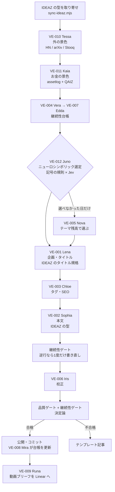

# Genesis Vault

**思考の種を保管する、静かなデジタル日記**
Mina Eureka Ernst による個人ブログ

🌐 **サイト**: https://genesisvault.vercel.app

---

## 概要

Genesis Vault は、Mina Eureka Ernst（ミナ・エウレカ・エルンスト）の個人日記ブログです。
散歩・瞑想・ひとり旅・ジャーナリング・読書・投資・AI をテーマに、毎日 **12体のAIエージェント（Liminal Forge）** が1本ずつ記事を書いて公開します。

毎朝の流れは次の4段です。

1. **外を見る。** AI の話題と相場の地合いを集める
2. **お金を見る。** QAIZ（相場の地形）と assetlog（自分の資産推移）を読む
3. **テーマを決める。** 判断AI の **Jev** と決定論の規則を組み合わせて、今日の1本を選ぶ（ニューロシンボリック）
4. **書く。** IDEAZ の型で書いて、決定論の検査と審査役を通ったものだけを公開する

**課金される口は1つもありません。** API の無料枠と、鍵の要らない公開データだけで回ります。

記事は **Ethereum ウォレット接続（3 USDC）** で全文を読めます。

---

## このリポジトリの歩き方

生成は安く、検証が高い。だからこのリポジトリは「エージェントが速く書けること」より
**「人間が速く判定できること」**を優先して構成されています。触る前に見る場所はこれだけです。

| 見る場所 | 何が分かるか |
|---------|-------------|
| [`config/pipeline.json`](./config/pipeline.json) | パイプラインの設定すべて（エージェント・プロバイダー・ルーティング・品質閾値・財務・選定・書き方の型）。**設定はここ1枚だけ** |
| [`docs/almanac/`](./docs/almanac/) | 壊してはいけない前提・一度踏んだ罠・ADR/Runbook の索引 |
| [`AGENTS.md`](./AGENTS.md) | AI が従う開発プロトコル（最優先） |
| `bun run verify` | マージしてよいかを決める単一コマンド |
| [`src/lib/pipeline/review.ts`](./src/lib/pipeline/review.ts) | 囲い（審査層）。生成物を落とすか通すかを決める |
| [`docs/selection-runs/`](./docs/selection-runs/) | 毎日のテーマ選定の記録（採用・負けた候補・規則で落とした候補） |
| [`prompts/ideaz/`](./prompts/ideaz/) | 書き方の型（IDEAZ の memory/ の写し） |

```bash
bun run verify         # 設定・記事リント・記憶の鮮度・型・テストを一括検証
bun run verify:quick   # 設定と記事リントのみ（数秒）
```

`verify` は **LLM もネットワークも API キーも使いません**。ローカルと CI で同じ答えが出ることが、
ゲートとして信用できる条件だからです（詳細は [ADR-0015](./docs/adr/0015-workflow-restructure.md)）。

設定を変えたいときは TypeScript を探さないでください。`config/pipeline.json` を編集して
`bun run verify` を実行すれば、スキーマ検証と参照整合性チェックが結果を教えます。

---

## 毎日なにが起きるか

GitHub Actions（[`daily-post.yml`](./.github/workflows/daily-post.yml)）が **毎日 19:30 MYT（11:30 UTC）** に走ります。



どの段が落ちても記事は止まりません。財務が取れなければ財務なしで書きます。
Jev が使えなければ無料 LLM が選び、それも無ければ記号の順位だけで選びます。
AI が全滅した日だけはテンプレート記事が出ます。

> **テンプレート記事が2日続いたら障害です。** テンプレートは止まらないための保険で、毎日の出力ではありません。
> 2026-09-16〜10-10 の24本は、1文字の打ち間違いのせいで全部テンプレートでした（[LM-017](./docs/almanac/LANDMINES.md)、修正済み）。

---

## 全部タダで回る

| 何を | どこで | 料金 | 鍵 |
|------|-------|------|-----|
| 自分の資産推移 | assetlog の公開スプレッドシート（gviz） | 無料 | 不要 |
| 相場の地形 | [QAIZ](https://github.com/gentaron/QAIZ) の `/api/overview`（Cloudflare Workers 無料プラン） | 無料 | 不要（URL だけ） |
| 外の景色 | Hacker News / arXiv / Stooq | 無料 | 不要 |
| テーマ選定 | **Jev on Cloudflare Workers AI**（無料枠 1日 10,000 Neurons） | 無料 | Cloudflare のトークン |
| 選定の代役 | Gemini / GitHub Models / Groq の無料枠 | 無料 | 下の表 |
| 執筆・校正 | Gemini 無料枠 → **GitHub Models 無料枠** → Groq / Cerebras / OpenRouter `:free` / HuggingFace | 無料 | 下の表 |
| 書き方の型 | [IDEAZ](https://github.com/gentaron/IDEAZ) の memory/（raw.githubusercontent） | 無料 | 不要 |
| 実行 | GitHub Actions | 無料枠 | — |

GitHub Models は、Actions に最初からある `GITHUB_TOKEN` だけで呼べます（ワークフローに `models: read` を付けてあります）。登録する鍵は増えません。

Workers AI の無料枠は、Jev の選定にすべて回すため、文章を書くチェーンには入れていません。
`workers-ai` の SDK は配線済みなので、載せたくなったら `config/pipeline.json` に追記するだけで済みます。

---

## セットアップ：どこに何を登録するか

### GitHub（自動投稿用）

場所: **リポジトリの Settings → Secrets and variables → Actions**

| 種類 | Name | 必須度 | 中身 | 無いとどうなる |
|------|------|--------|------|---------------|
| Secret | `GEMINI_API_KEY` | **ほぼ必須** | [Google AI Studio](https://aistudio.google.com) の無料キー | メインの書き手が使えない |
| Secret | `CLOUDFLARE_ACCOUNT_ID` | **推奨** | Cloudflare の Account ID（Workers & Pages の画面右側） | Jev が呼ばれない（選定は LLM か記号の順位になる） |
| Secret | `CLOUDFLARE_API_TOKEN` | **推奨** | My Profile → API Tokens → テンプレート「Workers AI」で作成 | 同上 |
| Variable | `QAIZ_BASE_URL` | 推奨 | `https://qaiz.〇〇.workers.dev`（末尾の `/` なし） | QAIZ を読まない（assetlog だけで動く） |
| Secret | `GROQ_API_KEY` | 任意 | Groq の無料キー | 書き手の予備が減る |
| Secret | `CEREBRAS_API_KEY` | 任意 | Cerebras の無料キー | 同上 |
| Secret | `OPENROUTER_API_KEY` | 任意 | OpenRouter のキー（`:free` モデルだけを使う） | 同上 |
| Secret | `HF_TOKEN` | 任意 | HuggingFace のトークン | 同上 |
| Secret | `TYPESAFE_API_KEY` | 任意 | TypeSafe の早期アクセスキー（waitlist） | 審査役は Gemini が担当。選定の Jev は Cloudflare 経由で動くので影響なし |
| Secret | `LINEAR_API_KEY` | 任意 | Linear の API キー | 動画ブリーフが起票されない |
| Secret | `VAIZ_DISPATCH_TOKEN` | 任意 | VAIZ を起こすための GitHub トークン | VAIZ は翌朝の定時に拾う |
| Secret | `PUBLIC_SENTRY_DSN` / `SENTRY_AUTH_TOKEN` | 任意 | Sentry | エラー通知が来ない |
| — | `GITHUB_TOKEN` | 登録不要 | GitHub が自動で用意する | — |

### Vercel（サイトとペイウォール API 用）

場所: **Vercel のプロジェクト → Settings → Environment Variables**

| Name | 中身 | 無いとどうなる |
|------|------|---------------|
| `PAYWALL_SECRET` | ペイウォールの Cookie に署名する HMAC 鍵（長いランダム文字列） | ペイウォールが動かない |
| `RECEIVER_ADDRESS` | USDC の受取アドレス（API 側の検証用） | 既定のアドレスが使われる |
| `PUBLIC_RECEIVER_ADDRESS` | 同じ受取アドレス（ブラウザ側の送金先） | 既定のアドレスが使われる |
| `ETH_RPC_URL` | Ethereum の RPC URL | 公開 RPC（publicnode）が使われる |
| `PUBLIC_SENTRY_DSN` / `SENTRY_AUTH_TOKEN` | Sentry | エラー通知が来ない |
| `PUBLIC_UMAMI_HOST` / `PUBLIC_UMAMI_WEBSITE_ID` | Umami アナリティクス | 計測しない |

### 動いたかの確かめ方

Actions → **Genesis Vault — Multi-Agent Daily Post** の実行ログで、次の行を探します。

| ログに出る文字 | 意味 |
|---|---|
| `method=jev` | Jev がテーマを選んだ |
| `method=llm` / `method=symbolic` | Jev が使えず、代役が選んだ（`ℹ️ jev: ...` の行に理由が出る） |
| `✅ 記号の事実: ...` | assetlog（と QAIZ）が読めた |
| `📐 IDEAZ の型を執筆陣へ渡します` | 型が書き手に渡った |
| `📋 Falling back to template...` | **テンプレートに落ちた。2日続いたら障害** |

その日の記事がすでにあるときは、実行しても最初の段階で止まります（冪等）。

---

## 12のエージェント

`config/pipeline.json` の `agents` が名簿と実行順の正本です。

| 順 | ID | エージェント | 役割 |
|---|----|-------------|------|
| 1 | VE-010 | **Tessa Brandt** (Scout) | AI・最先端技術の話題と相場の地合いを集める（トレンド・レーダー） |
| 2 | VE-011 | **Kaia Brennan** (Treasurer) | QAIZ と assetlog を読み、変化率と記号の事実に落とす（財務パルス） |
| 3 | VE-004 | **Vera Holt** (Researcher) | 過去記事から確定事実（金額・継続日数・年数・冊数）を抜き出す |
| 4 | VE-005 | **Nova Harmon** (Balancer) | テーマ残高を分析する。Juno が選べなかった日だけテーマを選ぶ |
| 5 | VE-012 | **Juno Albrecht** (Arbiter) | 記号の規則と Jev を組み合わせて、今日の1本を決める（ニューロシンボリック選定） |
| 6 | VE-001 | **Lena Strauss** (CEO) | トピック・切り口・タイトルを決める（IDEAZ のタイトル規格） |
| 7 | VE-003 | **Chloe Verdant** (SEO) | タグ・キーワード・メタディスクリプションを作る |
| 8 | VE-002 | **Sophia Nightingale** (Writer) | 本文を書く（IDEAZ の型・2,500〜4,800字） |
| 9 | VE-006 | **Iris Koenig** (Editor) | 型を壊さずに校正する |
| 10 | VE-007 | **Edda Lindgren** (Summarizer) | 抜き出した事実を継続性台帳にまとめ、逆行禁止ブリーフを作る |
| 11 | VE-008 | **Mira Falk** (Recorder) | 公開した記事の確定事実を台帳に記録する |
| 12 | VE-009 | **Runa Vogel** (Briefer) | 公開後に別工程で走る。記事から短尺動画のブリーフを起こし、Linear へ渡す |

各エージェントのプロンプトは `prompts/<名前>/vX.Y.Z.md` にあります。

---

## お金の景色（VE-011 Kaia）

書く前に、外の相場と自分の資産の両方を見ます。設定は `config/pipeline.json` の `finance` です。

| 何を | どこから | 出すもの |
|------|---------|---------|
| 自分の資産推移 | assetlog の公開シート（`logs`）を gviz で読む | 前日比・1週間・1か月の変化率、高値からの距離、何日続けて同じ向きか、30日ボラティリティ |
| 相場の地形 | QAIZ の `GET /api/overview` | レジーム（トレンド・ボラティリティ・リスク選好）、市場の幅、1週間で強かった/弱かったセクター、象限が切り替わったセクター |

観測は**記号の事実**に変換します。テーマ選定の規則はこれを読みます。

| 記号 | 意味（閾値は `finance.thresholds`） |
|------|------|
| `portfolio.new_high` / `portfolio.near_high` | 記録の最高値 / 最高値から1%以内 |
| `portfolio.drawdown` | 最高値から5%以上離れている |
| `portfolio.big_up_day` / `portfolio.big_down_day` | 1日で±1.5%以上動いた |
| `portfolio.quiet_day` | ほとんど動かなかった |
| `portfolio.up_streak` / `portfolio.down_streak` | 4日以上続けて同じ向き |
| `portfolio.month_up` / `portfolio.month_down` | 1か月で±3%以上 |
| `market.bull` / `market.bear` / `market.range` | QAIZ のトレンド判定 |
| `market.risk_on` / `market.risk_off` | リスク選好 |
| `market.vol_high` / `market.vol_low` | ボラティリティ環境 |
| `market.narrow` | 一部の銘柄だけが上げている |
| `market.rotation_new_leader` | 新しく「先行」象限に入ったセクターがある |
| `divergence.market_up_me_down` / `divergence.market_down_me_up` | 相場と自分の資産が逆を向いている週 |

守っていること:

- **金額は持ちません。** 型の上で、変化率と向きしか持てないようにしてあります（`disclosure: relative`）。毎日コミットされる `data/finance-pulse.json` にも、記事にも、実額は出ません。継続性台帳は「総資産額は逆行しない」を前提にしているので、実際に上下する実額を書くと、相場が下がった日に台帳と現実がぶつかるためです
- **予測しません。** 記号の事実は見ればわかることだけです。「買い場」「危険」のような解釈は作りません
- 書き手へのブリーフには、必ず使い方の制約が付きます（金額を書かない／投資助言をしない／数字は2つまで／「貯金」系の語を使わない）
- 取れなければ、直近3日以内のスナップショットを使います。それも無ければ財務なしで書きます（fail-soft）

---

## テーマ選定（VE-012 Juno × Jev）— ニューロシンボリック

文章を生成する LLM に選ばせると、規則違反の候補を選んでも、それらしい理由を書けてしまいます。
選定は判断であって文章ではありません。だから「規則を守る部分」はコードに、「どれが良いかの判断」は判断専用のモデルに分けています。

```
記号側（決定論・LLM なし）                     神経側（Jev）
─────────────────────────                    ─────────────────────────
1. 候補を作る                                  4. Choice: 生き残った候補 ID の中から1つ選ぶ
   財務の記号 / 技術の話題 / テーマ残高              （選択肢に無い ID は返せない）
2. 硬い規則で落とす                              5. Noul: 各候補で「関門の一文」を
   禁止語・テーマの冷却期間・既出との類似              誇張せずに埋められる確率
3. 特徴量
   不足度 0.4 / 顕著さ 0.35 / 新しさ 0.25
                    ╲                         ╱
                     6. 融合: final = 0.45·記号 + 0.55·Jev
                        Jev の確信度が 0.55 未満なら棄権扱い → 記号の順位で決める
```

| 段 | 中身 | 実装 |
|----|------|------|
| 候補生成 | 財務の記号ごとの企画（`FINANCE_RULES`）、トレンドの技術トピック最大3件、テーマ残高の不足上位4件 | `src/lib/selection/candidates.ts` |
| 硬い規則 | 未知のテーマ／禁止語（`qualityGate.forbiddenTopics`）／直近2日に使ったテーマ／既出見出し（このブログと note の公開済み867本）との bigram 類似度 0.6 以上／同じ企画の重複 | 同上 |
| 神経 | Jev に Choice（どれを書くか）と Noul（関門を埋められるか）を問う | `src/lib/ai/jev.ts` |
| 融合 | 加重和。確信度が低い Jev は棄権扱い（選択的予測） | `src/lib/selection/select.ts` |
| 記録 | 採用・負けた候補・落とした候補を全部残す | `docs/selection-runs/YYYY-MM.md` |

Jev の答えは、そのままは信じません。受け取る側で型検査をやり直します。宣言に無い選択肢や範囲外の確率は捨てます。
Jev は「型エラーは原理的に起きない」と主張していますが、それを確かめるのは受け取る側の仕事です（INV-013 と同じ考え方）。

経路は上から順に試します。

1. **Cloudflare Workers AI**（`@cf/typesafe/jev`、無料枠）— `CLOUDFLARE_ACCOUNT_ID` と `CLOUDFLARE_API_TOKEN`
2. **TypeSafe の直接 API**（`/v1/decisions`）— `TYPESAFE_API_KEY` があるときだけ
3. **無料 LLM チェーン** — 同じ候補 ID の enum で選ばせる
4. **記号の順位だけ** — 何も無くても選定は止まらない

モデル ID は `JEV_WORKERS_AI_MODEL`、TypeSafe 直のベース URL は `TYPESAFE_API_BASE_URL` で差し替えられます。
設定は `config/pipeline.json` の `selection` にあります。詳細は [ADR-0020](./docs/adr/0020-neuro-symbolic-selection-and-finance-pulse.md)。

---

## 書き方の型（IDEAZ）

本文は [IDEAZ](https://github.com/gentaron/IDEAZ) の型で書きます。note で実績のある型です。

| 渡すもの | 正本（`prompts/ideaz/`） | 誰に |
|---------|----------------------|------|
| 軸・書く前に埋める一文（関門）・シグナル5つ・ノイズ6つ | `canon.md` | Sophia |
| いちばん強い型 | `winning-patterns.md` | Sophia |
| 出力の形・文体・読みやすさ・中身・冒頭・思考の型 | `voice.md` | Sophia / Iris |
| タイトル規格 | `title.md` | Lena |
| 永久禁止と安全条件 | `forbidden.md` | Sophia |
| すでに使った題材の家族 | `exclusions.md` | Sophia（AI の題材の日だけ） |

- 組み立ては見出し単位で抜き出すだけです（`src/lib/format/ideaz.ts`）。文言はこのリポジトリに持たないので、二重管理になりません
- 毎朝 `scripts/sync-ideaz.mjs` が IDEAZ から取り寄せ直します。取れなかったり形が違ったりした日は、写しのまま書きます
- IDEAZ の軸は AI 向けに書かれています。そのため AI 以外の題材の日は「読み替え」を1段添えます。たとえば「自分のPCで動く」を「今日の自分の暮らし・時間・お金の範囲で試せる」と読み替えます
- このサイト向けの読み替えもあります。タイトルとハッシュタグは本文に書きません（別の係が付ける）。分量は 2,500〜4,800字です
- 見出し記号を使わない型なので、品質ゲートの `minH2Headings` は 0 にしています

---

## 囲い（審査層）

生成された記事は、執筆とは独立した審査を通ってからでないと公開されません。
設計の出発点は**「見逃しは何も表示しない」**という一点です。
甘い審査はエラーも警告も出さず、全部緑のまま雑なものを外に出します。
誤検知はうるさく、見逃しは静か。だから運用の直感に任せず、構造で防ぎます。

| 層 | 何をするか | LLM | どこで検証されるか |
|----|-----------|-----|------------------|
| 決定論ゲート | 文字数・体裁・プレースホルダー・定型表現・エージェントID | 不要 | `bun run verify`（毎回） |
| 審査役（judge） | 指示への追従・具体性・テーマのすり替え・整合 | 必要 | `bun run gate:eval` |
| 人間 | 最終マージ | — | PR |

審査役には **TypeSafe Jev（System One Model）を優先**し、失敗・未設定時は既存のLLMチェーン（Gemini等）にフォールバックします。Jev は文字列を生成しない構造化判定モデルで、構成されたスキーマ以外の型エラーを原理的に起こせず、ハルシネーションした引用を生成する余地がないため、審査層の信頼性を一段上げます（詳細は下記「Jev の2つの使い道」）。

### 審査役の5つの防御

1. **審査役には書き手と同等以上のモデルを配る** — 弱い審査役の見逃しは表示されない。設定チェックで機械的に禁止（INV-011）
2. **モデルは観察だけを返し、合否はコードが決める** — 採点者が自分の点数を申告する構造は甘くなる方向にしか壊れない（INV-013）
3. **減点には原稿からの逐語引用が要る** — 実在しない引用は照合して破棄する。この検証はモデルを使わない（INV-014）
4. **veto 項目は加重平均に参加しない** — テーマのすり替えと事実の逆行は一発不合格
5. **審査できなければ通さない（fail-closed）** — 閉じられないゲートは、閉じたことにする（INV-012）

審査役には企画指示と成果物しか渡しません。執筆時の文脈を持たせると、外部審査ではなく自己評価になります。

### ゲート自身を測る

記事の品質は審査役が測ります。では審査役の品質は誰が測るのか——という問いに、
`tests/fixtures/gate/` のゴールデン事例集が答えます。既知の不良と正常な対照群を意図的に置き、
**捕捉率と誤検知を数えられる**ようにしてあります。

```bash
bun run gate:eval        # 審査役の捕捉率・見逃し・捏造引用を測定（APIキー必須）
bun run gate             # 実際の原稿を審査（差し戻し時は .gate-quarantine/ へ隔離）
```

事例のうち2件は `blindspot`——**決定論では原理的に捕まえられないと分かっている不良**です
（体裁は完璧だが中身が一般論だけの記事／指示と別テーマにすり替わった記事）。
決定論テストはこれらが「通過してしまうこと」を明示的に固定しています。
成功の記録ではなく限界の記録で、審査役が唯一の防波堤であることを可視化するためのものです。

判定は通過分も含めて `docs/gate-runs/YYYY-MM.md` に残ります。
何を落としたかだけ記録しても、見逃しは見つからないためです。

詳細は [ADR-0016](./docs/adr/0016-the-enclosure.md)。

### Jev の2つの使い道

2026/9/15 に TypeSafe AI が公開した **Jev** は、文字列を生成しない「System One Model」です。
入力の文章を読んで、構造化された型安全な判定と確信度だけを返します（[TypeSafe AI ブログ](https://typesafe.ai/blog/introducing-system-one-models-and-jev)）。
このリポジトリでは、判断が要る2か所でだけ使います。

| 使い道 | どこで | 経路 | 鍵が無いとき |
|-------|-------|------|-------------|
| **テーマ選定** | `src/lib/selection/select.ts` → `src/lib/ai/jev.ts` | Workers AI 無料枠 → TypeSafe 直 | 無料 LLM → 記号の順位 |
| **審査役** | `src/lib/pipeline/review.ts` → `src/lib/ai/typesafe.ts` | TypeSafe 直（`/v1/decisions`） | Gemini 等の LLM チェーンが審査 |

| 項目 | 値 |
|------|------|
| 料金 | 入力 $0.042 / MTok、**出力無料**（Workers AI 経由なら無料枠の範囲で 0 円） |
| レイテンシ | 70–500ms |
| ステータス | 早期アクセス |

**文章を書く係には使えません。** Jev は文字列を返せないので、書き手や編集者の `preferredProviders` に入れるとカテゴリエラーになります。
`providers.ts` の `SDK_CLIENTS['typesafe']` は呼ばれたら明確なエラーを投げます。`buildProviderChain()` は `typesafe` を飛ばします。

---

## 継続性・トレンド・動画

### 過去記事整合性（継続性サブシステム）

Vera → Edda が過去記事から「継続性台帳」(`data/continuity-ledger.json`) を構築し、
**逆行禁止ブリーフ**を CEO/Writer に注入します。これにより
「貯金300万円達成の記事の後に貯金200万円達成の記事を書く」といった内容の逆行・矛盾を防ぎます。
投稿後は Mira が台帳を更新し、参照源を常に最新に保ちます。

- 継続性の正典ソース: 本パイプラインが生成した日記（`src/content/posts/`）
- 台帳は毎回そこから作り直す（キャッシュを信じない。導出できるものは導出する）
- 対象は金額だけではない。**話題を問わず**、単調増加する数値はすべて逆行禁止:
  貯金額 / 総資産額 / 投資額（円）、習慣の継続日数（瞑想・散歩・ジャーナリング等）、
  継続年数（積立投資・ブログ等）、読了冊数（年ごとにリセット）
- 各指標は「最高到達点」を正典とし、個人の現実的上限（1億円）超・統計引用・
  相場やニュース由来の数値は個人の事実から除外する

**ブリーフは指示であって保証ではない**ので、最後は決定論的なゲートが止めます
（`detectRegressions()`）。逆行を検出したら、指摘つきで書き手に1度だけ書き直させ、
校正後にもう一度確認し、テンプレートのフォールバックにも同じ判定を通します
（AI が全滅した日にだけ逆行が出るのが、いちばん見つけにくい壊れ方なので）。
回想は矛盾ではないので、「始めた頃は貯金100万円だった」は通ります。

### トレンド・レーダー（外の景色）

VE-010 Tessa が、記事を書く前に外で何が起きているかを集めます。

| 何を | どこから | 何に使うか |
|------|---------|-----------|
| AI・最先端技術の話題 | Hacker News (Algolia API) / arXiv | テーマ選定・企画のフック |
| 株式市場の地合い | Stooq 日足（S&P500 / 日経平均 / ドル円 / BTC） | その日の空気感（5日変化率・20日移動平均との位置） |

- **API キー不要のソースだけ**を使います（鍵の有無で挙動が変わらないように）
- **fail-soft**: 取得できなければ `degraded` として記録し、記事は通常どおり書きます。
  直近3日以内のスナップショット（`data/trend-radar.json`）があればそれを使います
- 相場は**予測しません**。見ればわかることだけを言葉にして、判断は書き手に渡します
- ブリーフには必ず**使い方の制約**が付きます（1〜2文まで／投資助言は書かない／
  レーダーの数字をミナ自身の資産額として書かない）。材料だけ渡すと日記がニュース要約に化けるので

### 記事 → 動画（Phase μ）

公開した記事は、そのまま短尺動画の企画になります。

```
記事を push
  ▼ VE-009 Runa      記事 → 動画ブリーフ（テーマ / 伝えたいこと / トーン / 尺 / ビジュアル）
  ▼ Linear           Todo + agent-ready で起票
  ▼ VAIZ             ブリーフを claim → 画像・音声・描画 → 同じ Issue に mp4 を添付
```

境界は Linear だけです。Genesis Vault は Issue を置くだけ、
[VAIZ](https://github.com/gentaron/VAIZ) は Issue を拾うだけで、互いを知りません。
同じ形式で人間が手書きした Issue も、VAIZ からは区別なく処理されます。

`agent-ready` は無人パイプラインの着手合図なので、貼る前に4つの機械的な制約
（冪等・背圧・決定論検証・転載検出）を全部通します。どれか1つでも欠けたら
Issue を作らずに終わります（INV-017）。

- 設計判断: [ADR-0017](./docs/adr/0017-video-brief-handoff.md)
- 運用手順: [docs/runbooks/video-brief.md](./docs/runbooks/video-brief.md)
- 手で試す: `bun run video:brief:dry`（Linear には触りません）

### 参照源（文体・テーマ）

文体サンプル・タイトル・テーマバランスの参照には、次の WXR エクスポートを使います（`config/pipeline.json` の `references`）。

- `gensnotes_1.md` / `gensnotes_2.md` — 旧ブログ「旧Gens Notes」（レガシー）
- `gensnotes_3.md` / `gensnotes_4.md` / `gensnotes_5.md` — 現行ブログ「Genesis Vault - ミナ・エウレカ」（**現時点の最新参照源**）

既出チェック用に、note の公開済み見出し（タイトルのみ）を `data/published-titles.json` に写しています（`sync-ideaz.mjs` が更新）。

---

## AI プロバイダーとルーティング

API キーが入っているものだけがチェーンに入ります。チェーンの順番が、そのままフォールバックの順番です。

| 名前 | SDK / モデル | 鍵 | 無料枠の目安 |
|------|-------------|-----|-------------|
| `gemini-2.5-flash-lite` | Google `gemini-2.5-flash-lite` | `GEMINI_API_KEY` | 15 RPM / 1,000 RPD |
| `gemini-2.5-flash` | Google `gemini-2.5-flash` | `GEMINI_API_KEY` | 10 RPM / 250 RPD |
| `github-models-gpt-4.1` | GitHub Models `openai/gpt-4.1` | `GITHUB_TOKEN`（自動） | 10 RPM / 50 RPD |
| `github-models-gpt-4.1-mini` | GitHub Models `openai/gpt-4.1-mini` | `GITHUB_TOKEN`（自動） | 15 RPM / 150 RPD |
| `groq-llama-3.3-70b` | Groq `llama-3.3-70b-versatile` | `GROQ_API_KEY` | 30 RPM / 14,400 RPD |
| `cerebras-llama-3.3-70b` | Cerebras `llama-3.3-70b` | `CEREBRAS_API_KEY` | 30 RPM / 14,400 RPD |
| `openrouter-llama` / `-qwen` / `-deepseek` | OpenRouter の `:free` モデル3種 | `OPENROUTER_API_KEY` | 20 RPM / 200 RPD |
| `huggingface` | HF `Llama-3.3-70B-Instruct` | `HF_TOKEN` | 10 RPM / 500 RPD |
| `typesafe-jev` | TypeSafe Jev（**審査専用**。LLM チェーンには入らない） | `TYPESAFE_API_KEY` | — |

テーマ選定の Jev（Workers AI 経由）は、このチェーンとは別の経路です（上の「テーマ選定」を参照）。

**役割ごとのルーティング**（`config/pipeline.json` の `routing.byAgent`。各行の理由は `why` に書いてあります）

| エージェント | ティア | 優先プロバイダー | temp | 出力上限 |
|-------------|--------|----------------|------|---------|
| Nova (Balancer) | light | Groq → Cerebras → flash-lite | 0.3 | 512 |
| Juno (Arbiter・代役 LLM) | light | flash-lite → GitHub gpt-4.1-mini → Groq | 0 | 512 |
| Lena (CEO) | creative | flash → flash-lite → Groq | 0.9 | 1,024 |
| Chloe (SEO) | light | flash-lite → Groq → Cerebras | 0.4 | 512 |
| Sophia (Writer) | heavy | flash → flash-lite → GitHub gpt-4.1 | 0.85 | 8,192 |
| Iris (Editor) | judge | flash → flash-lite → GitHub gpt-4.1 | 0.2 | 8,192 |
| Runa (Briefer) | creative | flash → flash-lite → Groq | 0.6 | 1,024 |

審査役（Iris）の最優先モデルは、書き手（Sophia）と同じでなければなりません。これは `verify` が機械的に検査します（INV-011）。
優先プロバイダーが失敗・未設定のときは、残りのチェーンに自動でフォールバックします。

---

## 技術スタック

### コア・フレームワーク

| 技術 | バージョン | 役割 |
|------|-----------|------|
| [Astro](https://astro.build/) | 5.18.1 | 静的サイトジェネレーター（SSG）。Content Layer API、View Transitions ネイティブ対応 |
| [TypeScript](https://www.typescriptlang.org/) | ^5.8.0 | 型安全な開発。`astro/tsconfigs/strict` を継承 |
| [Bun](https://bun.sh/) | 1.3.12 | ランタイム兼パッケージマネージャー。高速な依存関係インストール・実行 |
| [ES Modules](https://nodejs.org/api/esm.html) | — | `"type": "module"` によりパッケージ全体で ESM を使用 |

### Astro インテグレーション

| パッケージ | バージョン | 役割 |
|-----------|-----------|------|
| [@astrojs/mdx](https://docs.astro.build/en/guides/integrations-guide/mdx/) | 4.3.14 | `.mdx` ファイルサポート。Markdown 内にコンポーネントを埋め込み可能 |
| [@astrojs/check](https://docs.astro.build/en/guides/integrations-guide/check/) | 0.9.9 | Astro 向け TypeScript 型チェッカー |

### コンテンツ管理

| 技術 | 詳細 |
|------|------|
| [Astro Content Collections](https://docs.astro.build/en/guides/content-collections/) | `src/content/posts/` 以下の Markdown ファイルを Zod スキーマで型検証 |
| [Zod](https://zod.dev/) | ^4.4.3。`title`, `date`, `mood`, `weather`, `tags`, `description`, `keywords`, `agents` 等のフィールドを定義 |
| [Shiki](https://shiki.style/) | コードブロックのシンタックスハイライト。テーマ: `github-light`、行折返し有効 |
| [Pagefind](https://pagefind.app/) | 静的サイト内全文検索。ビルド時にインデックス生成 |

### スタイリング

| 技術 | 詳細 |
|------|------|
| [Tailwind CSS](https://tailwindcss.com/) | v4。`@theme` ディレクティブでデザイントークンを定義 |
| [Google Fonts](https://fonts.google.com/) | Noto Serif JP（見出し用）+ Noto Sans JP（本文用）。ウェイト: 300/400/500/600/700 |
| CSS Custom Properties | `--color-*` によるデザインシステム。Tailwind `@theme` に統合 |
| CSS Animations | `@keyframes` による `shimmer` / `pulse-ring` / `float` の3種（Tailwind `@theme` にも登録） |
| CSS Dark Mode | `.dark` クラス切替。`localStorage` に `color-theme` を保存し永続化 |
| Glassmorphism | `backdrop-filter: blur(12px)` をウォレットカード等で使用 |
| レスポンシブデザイン | `@media (max-width: 640px)` でモバイル対応 |

### AI パイプライン（Multi-Agent System）

| 技術 | 詳細 |
|------|------|
| [Vercel AI SDK](https://sdk.vercel.ai/) | v5。`generateObject`（構造化出力）と `generateText`（自由テキスト） |
| [Google Gemini API](https://ai.google.dev/) | `@ai-sdk/google`。`gemini-2.5-flash`（執筆・審査）＋ `gemini-2.5-flash-lite` |
| [GitHub Models](https://docs.github.com/en/github-models) | `@ai-sdk/openai-compatible`。`openai/gpt-4.1` / `gpt-4.1-mini`。Actions の `GITHUB_TOKEN` だけで使える無料枠 |
| [Cloudflare Workers AI](https://developers.cloudflare.com/workers-ai/) | Jev（`@cf/typesafe/jev`）でテーマを選ぶ。無料枠 1日 10,000 Neurons |
| [TypeSafe Jev](https://typesafe.ai/) | System One Model。文字列を生成せず、型の決まった判定と確率だけを返す。選定と審査の2か所で使う |
| [Groq](https://groq.com/) / [Cerebras](https://cerebras.ai/) | `llama-3.3-70b`。無料枠の予備 |
| [OpenRouter](https://openrouter.ai/) | `:free` モデル3種を順に試す（ADR-0010） |
| [HuggingFace](https://huggingface.co/) | `Llama-3.3-70B-Instruct`。サーバーレス無料枠 |
| Multi-Agent Pipeline | 12エージェント。名簿と実行順は `config/pipeline.json`、実装は `src/lib/agents/` |
| Finance Pulse | VE-011 Kaia。assetlog（gviz）と QAIZ を読み、変化率と記号の事実を出す。金額は持たない（ADR-0020） |
| Neuro-Symbolic Selection | VE-012 Juno。記号の規則で候補を絞り、Jev の Choice / Noul と融合する。確信度が低ければ棄権扱い（ADR-0020） |
| IDEAZ Format | `prompts/ideaz/` の型を見出し単位で組み立てて、Lena / Sophia / Iris に渡す |
| Trend Radar | VE-010 Tessa。HN / arXiv / Stooq。API キー不要・fail-soft（ADR-0018） |
| Continuity Gate | 金額・継続日数・年数・冊数の逆行を決定論で検出する。原稿・校正後・テンプレートの3か所で確認（ADR-0018） |
| Declarative Config | `config/pipeline.json` が設定の唯一の正本。Zod 検証と参照整合性チェック（ADR-0015） |
| Article → Video Handoff | VE-009 Runa → Linear → VAIZ（ADR-0017） |
| Agent Telemetry | `logs/agent-runs.jsonl`（実行ごと）と `docs/agent-runs/YYYY-MM.md`（公開の要約） |
| Dry Run / Idempotency / Resume | `bun run gen:dry`。同じ日の重複投稿を防ぐ。`.pipeline-state.json` で途中から再開できる |

### Web3 / ブロックチェーン

| 技術 | 詳細 |
|------|------|
| [Ethereum Mainnet](https://ethereum.org/) | Chain ID: `0x1`。ウォレット接続・送金確認に使用 |
| [USDC (ERC-20)](https://www.circle.com/usdc) | コントラクト: `0xA0b86991c6218b36c1d19D4a2e9Eb0cE3606eB48`。3 USDC のペイウォール決済 |
| [viem](https://viem.sh/) | 2.x。型安全な ABI エンコード・デコード。Tree-shakeable（~6kB） |
| [EIP-6963](https://eips.ethereum.org/EIPS/eip-6963) | マルチウォレット検出（MetaMask, Brave, Coinbase Wallet, Rabby, Frame, Phantom-EVM, Rainbow 等）。`window.ethereum` 直接アクセスは廃止（フォールバックのみ） |
| viem WalletClient | `createWalletClient` + `custom(provider)` による EIP-1193 プロバイダ接続。チェーン検証・自動切替 |
| viem PublicClient | `waitForTransactionReceipt` によるインテリジェントレシートポーリング（2確定、120秒タイムアウト）。旧40回×3秒ポーリングを置換 |
| Server-side Paywall | Vercel Edge Function による HMAC 署名 Cookie 検証（Phase δ） |

### Nostr（分散型ソーシャルプロトコル）

| 技術 | 詳細 |
|------|------|
| [nostr-tools](https://github.com/nbd-wtf/nostr-tools) | ^2.10.0。`SimplePool` / `finalizeEvent` / `verifyEvent`（`nostr-tools/pure` サブパス） |
| [NIP-23](https://github.com/nostr-protocol/nips/blob/master/23.md) | Long-form Content（kind: 30023）。`d` / `title` / `published_at` / `summary` / `t` タグを使用 |
| WebSocket リレー | `wss://relay.damus.io`, `wss://nos.lol`, `wss://relay.snort.social`, `wss://relay.nostr.band` |
| イベント署名 | `secp256k1` による Nostr イベント署名と検証 |

### IPFS（分散型ストレージ）

| 技術 | 詳細 |
|------|------|
| [Pinata API](https://www.pinata.cloud/) | IPFS ピニングサービス（Free Tier: 1GB）。`/pinning/pinFileToIPFS` エンドポイント |
| CIDv1 | `pinataOptions.cidVersion: 1` でコンテンツアドレス指定 |
| IPFS Gateway | `ipfs.io` / `gateway.pinata.cloud` 経由でアーカイブ参照 |

### テスト

| 技術 | 詳細 |
|------|------|
| [Vitest](https://vitest.dev/) | 4.x。ユニットテスト（件数は `bun run test` で確認）。v8 カバレッジを CI で強制 |
| [@vitest/coverage-v8](https://vitest.dev/guide/coverage) | v8 カバレッジプロバイダー。CI で閾値強制 |
| [happy-dom](https://github.com/capricorn86/happy-dom) | DOM テスト用ランタイム |
| [Playwright](https://playwright.dev/) | 1.50+。E2E テスト（6 ユーザージャーニー）。Chromium 対応 |

### CI/CD・自動化

| 技術 | 詳細 |
|------|------|
| [GitHub Actions](https://github.com/features/actions) | `daily-post.yml`（自動生成）+ `healthcheck.yml` + `ci-verify.yml`（決定論的ゲート）+ `ci-test.yml`（Unit+Coverage）+ `ci-e2e.yml`（Playwright）+ `codeql.yml`（セキュリティスキャン） |
| Spec as Contract | Issue テンプレートが受け入れ条件と非目標を必須化。PR テンプレートは「契約が満たされた証明」を書かせる（ADR-0015） |
| Deterministic Verify | `bun run verify` が LLM 不要・オフラインで設定・記事・記憶・型・テストを検証。CI と同一コマンド |
| [oven-sh/setup-bun](https://github.com/oven-sh/setup-bun) | v2。CI で Bun を使用 |
| [CodeQL](https://codeql.github.com/) | セキュリティスキャン（JS/TS）。Push/PR + 毎週月曜実行 |
| [Renovate](https://github.com/renovatebot/renovate) | 依存関係の自動更新（パッチ auto-merge） |
| [Vercel](https://vercel.com/) | 自動デプロイ + Edge Functions（ペイウォール検証 API） |
| Conventional Commits | `feat:`, `fix:`, `docs:`, `refactor:`, `test:`, `chore:` の形式を採用（AGENTS.md で規定） |

### オブザーバビリティ（Phase η）

| 技術 | 詳細 |
|------|------|
| [Sentry](https://sentry.io/) | エラー追跡 + パフォーマンス監視。Free Tier: 5K errors/month, 10% trace sampling。`@sentry/astro` v10 で統合 |
| [Umami](https://umami.is/) | プライバシー重視のアナリティクス（Cookie-free, self-hosted）。Plausible CE から移行（Postgres-onlyでデプロイ簡易化） |
| [Pagefind](https://pagefind.app/) | 静的サイト内全文検索。Cmd+K で検索ダイアログ。ゲート記事の本文は `data-pagefind-ignore` でインデックス除外 |
| Healthcheck | GitHub Actions で6時間ごとにサイト死活監視 + 記事鮮度チェック + ペイウォール検証。失敗時に自動 Issue 作成 |
| Agent Telemetry | `docs/agent-runs/YYYY-MM.md` に毎回のパイプライン実行ログを公開（使用プロバイダ・試行回数・レイテンシ） |
| /status | ビルド時生成のシステムステータスページ（最新記事・総記事数・エージェント実行履歴・監視スタック概要） |
| Scheduled Post Verify | 毎日 12:00/13:00 UTC に自動投稿が正常にコミットされたか検証するワークフロー |

### 開発ツール・規約

| 技術 | 詳細 |
|------|------|
| [Biome](https://biomejs.dev/) | 2.x。Linter + Formatter。ESLint + Prettier の25倍高速。単一設定ファイル |
| [Bun](https://bun.sh/) | 1.3.12。パッケージマネージャー兼ランタイム |
| AGENTS.md | AI 開発プロトコル。デッドロック防止・反復キャップ・エラー分類・品質ゲート・パイプライン監視 |
| MIT License | オープンソースライセンス |

---

## 開発環境のセットアップ

```bash
bun install              # 依存関係のインストール
bun run dev              # 開発サーバー
bun run build            # ビルド（Pagefind 検索インデックス付き）
bun run preview          # プレビュー
bun run test             # ユニットテスト
bun run lint             # リント
bun run format           # フォーマット
```

### パイプラインを手で動かす

```bash
bun run gen:dry                      # ファイルを書かずに全工程を試す（鍵が無くても縮退して最後まで進む）
GEMINI_API_KEY=... bun run auto-post # 本番と同じ生成（その日の記事があればスキップ）
bun scripts/sync-ideaz.mjs           # IDEAZ の型と公開済み見出しを GitHub から取り寄せる
bun scripts/sync-ideaz.mjs ../IDEAZ  # 手元の IDEAZ チェックアウトから取り寄せる
```

### 検証ゲート・生成物の更新

```bash
# マージ可否を決める単一ゲート（LLM・ネットワーク・APIキー不要）
bun run verify
bun run verify:quick     # 設定と記事リントのみ（数秒）

# 生成物の再生成（手編集しないこと）
bun run config:schema    # config/pipeline.schema.json を Zod スキーマから再生成
bun run almanac          # docs/almanac/INDEX.md を ADR/Runbook から再生成
```

`verify` は生成物のドリフト（再生成し忘れ）も検出して失敗します。

### 既存指摘のラチェット

Biome と `astro check` にはリポジトリ発足以来の指摘が残っています。一括修正は
85ファイルの整形差分になりレビュー不能になるため、`config/quality-baseline.json` で
**件数を増やさないこと**だけを機械的に保証しています。触ったファイルだけを直してください。

```bash
bunx biome check --write <実際に変更したファイル>
```

---

## 既知の問題

| 問題 | 状態 | 記録 |
|------|------|------|
| CI の `Unit Tests + Coverage` が赤い | テストは全件通過。カバレッジのしきい値（行 85% / 分岐 75%）に届いていない。main では 9/5 以前から赤い。主な原因は `typesafe.ts`・`symbolic-guard.ts`・`review.ts`・`state.ts` のテスト不足 | — |
| 品質ゲートの禁止語チェックが走っていない | `qualityGate.forbiddenTopics` がスキーマ未宣言で、Zod に落とされている。有効にするとゴールデン事例の「正常な記事」が落ちるので、禁止語の範囲を決め直すまで保留。テーマ選定だけは生の JSON から読んで候補を落としている | [LM-018](./docs/almanac/LANDMINES.md) |
| `tierOmega` が読まれていない | 同じ理由で、どのコードからも参照されていない | [LM-018](./docs/almanac/LANDMINES.md) |
| Jev のリクエスト形状 | 公開情報から組んだもの。本番の初回ログ（`method=jev` が出るか）で確認する。合わなくても選定は記号の順位で続く | [ADR-0020](./docs/adr/0020-neuro-symbolic-selection-and-finance-pulse.md) |

---

## 記事の書き方

`src/content/posts/` に Markdown ファイルを作ります。

```markdown
---
title: 記事のタイトル
date: 2026-10-11
mood: "🌿 平和"
weather: "☀️"
tags: ["ジャーナリング", "散歩", "マインドフルネス"]
description: "SEO向けの説明文"
keywords: ["キーワード1", "キーワード2"]
agents:
  scout: "VE-010 Tessa Brandt"
  treasurer: "VE-011 Kaia Brennan"
  arbiter: "VE-012 Juno Albrecht"
  ceo: "VE-001 Lena Strauss"
  seo: "VE-003 Chloe Verdant"
  writer: "VE-002 Sophia Nightingale"
  editor: "VE-006 Iris Koenig"
---

ここに本文を書きます...
```

`agents` に書く ID は `config/pipeline.json` に存在するものだけです（記事リントが検査します）。

---

## コンテンツテーマ

Mina のペルソナに基づくテーマです（`THEME_KEYWORDS` の10分類）。

- 散歩・日常
- 瞑想・マインドフルネス
- ひとり旅
- ジャーナリング
- 読書
- 自己成長
- 投資・資産形成
- 暗号資産
- AI・テクノロジー
- 貯金・節約（※「貯金」系の語は品質ゲートの禁止語に入っているため、テーマ選定の記号の規則で落ちる）

---

## デプロイ

1. GitHub に push する
2. Vercel で新規プロジェクトを作り、このリポジトリを選ぶ（push のたびに自動デプロイ）
3. Vercel の Environment Variables に、上の「Vercel」の表の値を入れる
4. GitHub の Secrets / Variables に、上の「GitHub」の表の値を入れる

---

## Issue の読み方

**このリポジトリの Issue は、大半が人間の書いたものではありません。**
6 時間ごとのヘルスチェックが本番サイトを検査し、失敗すると Issue を開きます。

human が扱うべきものだけを見るには、`healthcheck` ラベルを除外してください。

```
is:issue is:open -label:healthcheck
```

| 出どころ | ラベル | 扱い |
|---|---|---|
| ヘルスチェック失敗 | `healthcheck` | 運用イベント。未解決の障害につき **1 件に集約**され、回復時に自動クローズ |
| バグ報告 / 機能要求 | `bug` / `enhancement` | 人間が立てたもの。手動トリアージ |
| 依存更新 | `dependencies` / `security` | Renovate。`security` は automerge |

2026 年 6 月時点で open な Issue が 194 件ありましたが、これは 194 個の問題ではなく、
**1 個の障害が 6 時間おきに再通知され続けた結果**です（当時は失敗のたびに新規 Issue を
作り、回復時に閉じる処理がありませんでした）。現在は重複排除と自動クローズを実装済みです。

詳細は [`docs/runbooks/issue-triage.md`](./docs/runbooks/issue-triage.md)。

---

## 関連リポジトリ

| リポジトリ | 説明 |
|-----------|------|
| [gentaron/QAIZ](https://github.com/gentaron/QAIZ) | 地域×セクターの株式分析ターミナル。お金の景色の「外の地形」 |
| [gentaron/assetlog](https://github.com/gentaron/assetlog) | 資産成長分析ダッシュボード。お金の景色の「自分の資産推移」と同じシートを読む |
| [gentaron/IDEAZ](https://github.com/gentaron/IDEAZ) | 1日5枠のブログ・フォーマット。書き方の型の正本 |
| [gentaron/VAIZ](https://github.com/gentaron/VAIZ) | 動画ブリーフを拾って短尺動画にする |
| [gentaron/edu](https://github.com/gentaron/edu) | EDU メインアプリケーション |
| [gentaron/edutext](https://github.com/gentaron/edutext) | ストーリーテキスト (JP/EN) |
| [gentaron/image](https://github.com/gentaron/image) | キャラクター画像 |
| [gentaron/eurekaspace](https://github.com/gentaron/eurekaspace) | EDU 百科事典サイト |
| [gentaron/laylaland](https://github.com/gentaron/laylaland) | Layla キャラクターサイト |
| [gentaron/irisworlds](https://github.com/gentaron/irisworlds) | Iris キャラクターサイト |

## ライセンス

[MIT License](LICENSE) — 全文はリポジトリ直下の `LICENSE` を参照。

---

**著者**: Mina Eureka Ernst（ミナ・エウレカ・エルンスト）
**サイト**: https://genesisvault.vercel.app
**コンセプト**: Liminal Forge AI × 静かなデジタル日記
